# [📈 Live Status](https://tradmusica.github.io): <!--live status--> **🟧 Partial outage**

This repository contains the open-source uptime monitor and status page for [tradmusica](https://tradmusica.github.io), powered by [Upptime](https://github.com/upptime/upptime).

With [Upptime](https://upptime.js.org), you can get your own unlimited and free uptime monitor and status page, powered entirely by a GitHub repository. We use [Issues](https://github.com/tradmusica/upptime/issues) as incident reports, [Actions](https://github.com/tradmusica/upptime/actions) as uptime monitors, and [Pages](https://tradmusica.github.io) for the status page.

<!--start: status pages-->
<!-- This summary is generated by Upptime (https://github.com/upptime/upptime) -->
<!-- Do not edit this manually, your changes will be overwritten -->
<!-- prettier-ignore -->
| URL | Status | History | Response Time | Uptime |
| --- | ------ | ------- | ------------- | ------ |
|  [bagpipe Category](https://bagpipe.de/onlinekurse-dudelsack/) | 🟩 Up | [bagpipe-category.yml](https://github.com/tradmusica/upptime/commits/HEAD/history/bagpipe-category.yml) | 

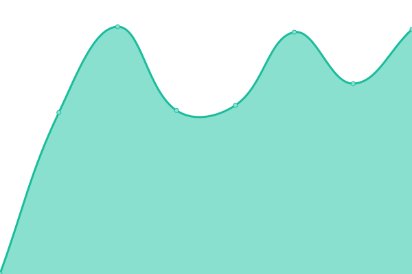 889ms
     
 | 

<a href="https://tradmusica.github.io/history/bagpipe-category">100.00%</a>
    

|  [BP Hallo HTTP non-WWW](http://bagpipe.de/hallo-dudelsack) | 🟩 Up | [bp-hallo-http-non-www.yml](https://github.com/tradmusica/upptime/commits/HEAD/history/bp-hallo-http-non-www.yml) | 

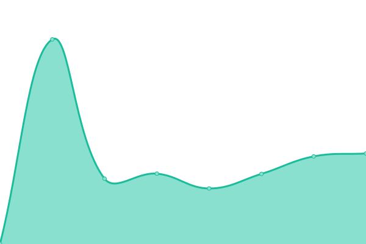 1131ms
     
 | 

<a href="https://tradmusica.github.io/history/bp-hallo-http-non-www">100.00%</a>
    

|  [BP Hallo HTTPS non-WWW](https://bagpipe.de/hallo-dudelsack) | 🟩 Up | [bp-hallo-https-non-www.yml](https://github.com/tradmusica/upptime/commits/HEAD/history/bp-hallo-https-non-www.yml) | 

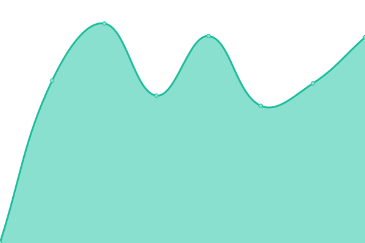 460ms
     
 | 

<a href="https://tradmusica.github.io/history/bp-hallo-https-non-www">100.00%</a>
    

|  [BP Hallo HTTPS WWW](https://www.bagpipe.de/hallo-dudelsack) | 🟩 Up | [bp-hallo-https-www.yml](https://github.com/tradmusica/upptime/commits/HEAD/history/bp-hallo-https-www.yml) | 

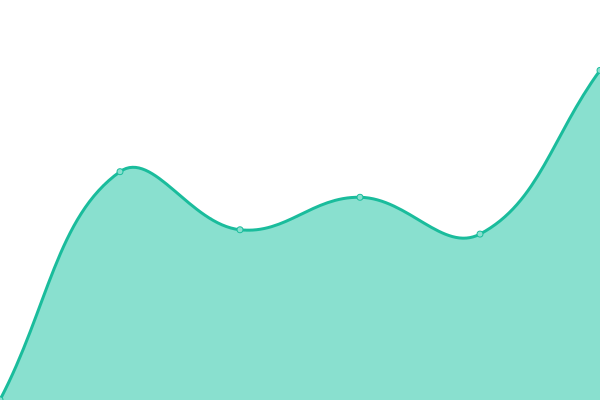 1244ms
     
 | 

<a href="https://tradmusica.github.io/history/bp-hallo-https-www">100.00%</a>
    

|  [BP Hallo HTTP WWW](http://www.bagpipe.de/hallo-dudelsack) | 🟩 Up | [bp-hallo-http-www.yml](https://github.com/tradmusica/upptime/commits/HEAD/history/bp-hallo-http-www.yml) | 

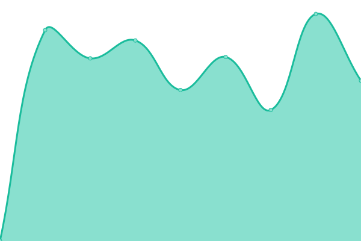 996ms
     
 | 

<a href="https://tradmusica.github.io/history/bp-hallo-http-www">100.00%</a>
    

|  [BP HTTP non-www](http://bagpipe.de) | 🟩 Up | [bp-http-non-www.yml](https://github.com/tradmusica/upptime/commits/HEAD/history/bp-http-non-www.yml) | 

 465ms
     
 | 

<a href="https://tradmusica.github.io/history/bp-http-non-www">100.00%</a>
    

|  [BP HTTPS non-www COMP](https://bagpipe.de/das-multi-einsteiger-set-fuer-den-schottischen-dudelsack/) | 🟩 Up | [bp-https-non-www-comp.yml](https://github.com/tradmusica/upptime/commits/HEAD/history/bp-https-non-www-comp.yml) | 

 461ms
     
 | 

<a href="https://tradmusica.github.io/history/bp-https-non-www-comp">100.00%</a>
    

|  [BP HTTPS non-www SHOP](https://bagpipe.de/shop/) | 🟩 Up | [bp-https-non-www-shop.yml](https://github.com/tradmusica/upptime/commits/HEAD/history/bp-https-non-www-shop.yml) | 

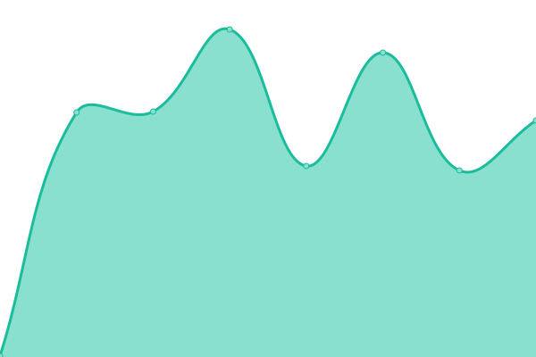 294ms
     
 | 

<a href="https://tradmusica.github.io/history/bp-https-non-www-shop">100.00%</a>
    

|  [BP HTTPS non-www +SSL](https://bagpipe.de) | 🟩 Up | [bp-https-non-www-ssl.yml](https://github.com/tradmusica/upptime/commits/HEAD/history/bp-https-non-www-ssl.yml) | 

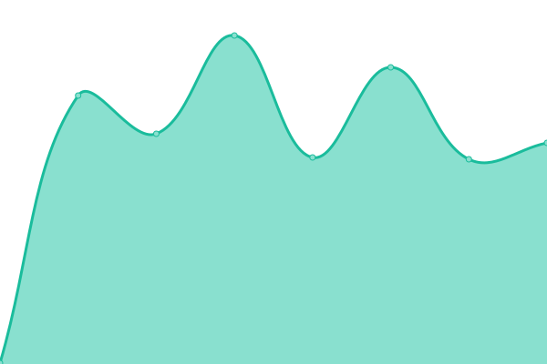 289ms
     
 | 

<a href="https://tradmusica.github.io/history/bp-https-non-www-ssl">100.00%</a>
    

|  [BP HTTPS www +SSL](https://www.bagpipe.de) | 🟩 Up | [bp-https-www-ssl.yml](https://github.com/tradmusica/upptime/commits/HEAD/history/bp-https-www-ssl.yml) | 

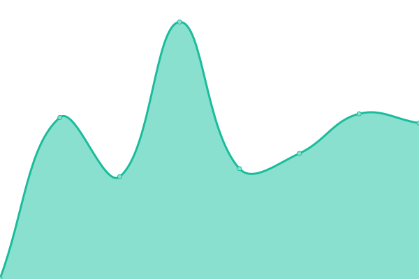 497ms
     
 | 

<a href="https://tradmusica.github.io/history/bp-https-www-ssl">100.00%</a>
    

|  [carovana HTTP](http://carovana.ch) | 🟥 Down | [carovana-http.yml](https://github.com/tradmusica/upptime/commits/HEAD/history/carovana-http.yml) | 

 0ms
     
 | 

<a href="https://tradmusica.github.io/history/carovana-http">0.00%</a>
    

|  [carovana HTTPS](https://carovana.ch) | 🟥 Down | [carovana-https.yml](https://github.com/tradmusica/upptime/commits/HEAD/history/carovana-https.yml) | 

 0ms
     
 | 

<a href="https://tradmusica.github.io/history/carovana-https">0.00%</a>
    

|  [carovana HTTPS WWW](https://www.carovana.ch) | 🟥 Down | [carovana-https-www.yml](https://github.com/tradmusica/upptime/commits/HEAD/history/carovana-https-www.yml) | 

 0ms
     
 | 

<a href="https://tradmusica.github.io/history/carovana-https-www">0.00%</a>
    

|  [carovana HTTP WWW](http://www.carovana.ch) | 🟥 Down | [carovana-http-www.yml](https://github.com/tradmusica/upptime/commits/HEAD/history/carovana-http-www.yml) | 

 0ms
     
 | 

<a href="https://tradmusica.github.io/history/carovana-http-www">0.00%</a>
    

|  [BP HTTP www](http://www.bagpipe.de) | 🟩 Up | [bp-http-www.yml](https://github.com/tradmusica/upptime/commits/HEAD/history/bp-http-www.yml) | 

 1807ms
     
 | 

<a href="https://tradmusica.github.io/history/bp-http-www">100.00%</a>
    

|  [BP MX](dns-resolve://bagpipe.de) | 🟥 Down | [bp-mx.yml](https://github.com/tradmusica/upptime/commits/HEAD/history/bp-mx.yml) | 

 0ms
     
 | 

<a href="https://tradmusica.github.io/history/bp-mx">0.00%</a>
    

|  [FW HTTP non-www](http://folk.world) | 🟩 Up | [fw-http-non-www.yml](https://github.com/tradmusica/upptime/commits/HEAD/history/fw-http-non-www.yml) | 

 1450ms
     
 | 

<a href="https://tradmusica.github.io/history/fw-http-non-www">100.00%</a>
    

|  [FW HTTPS DE BlogPost LIVE](https://folk.world/de/undaunted-von-stout-will-irischen-folk-neu-interpretieren/) | 🟩 Up | [fw-https-de-blog-post-live.yml](https://github.com/tradmusica/upptime/commits/HEAD/history/fw-https-de-blog-post-live.yml) | 

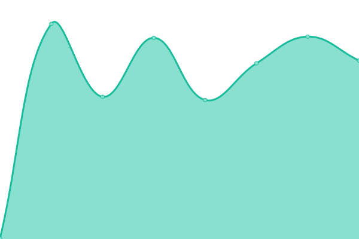 450ms
     
 | 

<a href="https://tradmusica.github.io/history/fw-https-de-blog-post-live">100.00%</a>
    

|  [FW HTTPS DE BlogTag LIVE](https://folk.world/de/tag/dudelsack/) | 🟩 Up | [fw-https-de-blog-tag-live.yml](https://github.com/tradmusica/upptime/commits/HEAD/history/fw-https-de-blog-tag-live.yml) | 

 378ms
     
 | 

<a href="https://tradmusica.github.io/history/fw-https-de-blog-tag-live">100.00%</a>
    

|  [FW HTTPS DE Cart LIVE](https://folk.world/de/warenkorb/) | 🟩 Up | [fw-https-de-cart-live.yml](https://github.com/tradmusica/upptime/commits/HEAD/history/fw-https-de-cart-live.yml) | 

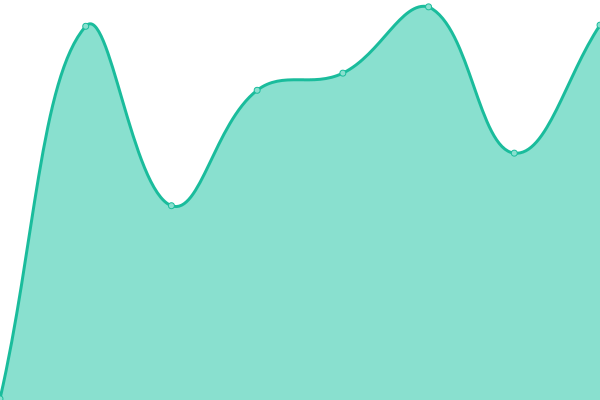 283ms
     
 | 

<a href="https://tradmusica.github.io/history/fw-https-de-cart-live">100.00%</a>
    

|  [FW HTTPS DE Page LIVE](https://folk.world/de/autor-werden/) | 🟩 Up | [fw-https-de-page-live.yml](https://github.com/tradmusica/upptime/commits/HEAD/history/fw-https-de-page-live.yml) | 

 218ms
     
 | 

<a href="https://tradmusica.github.io/history/fw-https-de-page-live">100.00%</a>
    

|  [FW HTTPS DE ShopHome LIVE](https://folk.world/de/shop/) | 🟩 Up | [fw-https-de-shop-home-live.yml](https://github.com/tradmusica/upptime/commits/HEAD/history/fw-https-de-shop-home-live.yml) | 

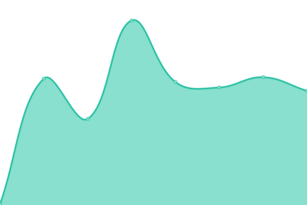 182ms
     
 | 

<a href="https://tradmusica.github.io/history/fw-https-de-shop-home-live">100.00%</a>
    

|  [FW HTTPS DE ShopProduct LIVE](https://folk.world/de/s/german-smallpipe/) | 🟩 Up | [fw-https-de-shop-product-live.yml](https://github.com/tradmusica/upptime/commits/HEAD/history/fw-https-de-shop-product-live.yml) | 

 441ms
     
 | 

<a href="https://tradmusica.github.io/history/fw-https-de-shop-product-live">100.00%</a>
    

|  [FW HTTPS DE ShopTag LIVE](https://folk.world/de/stag/dudelsack/) | 🟩 Up | [fw-https-de-shop-tag-live.yml](https://github.com/tradmusica/upptime/commits/HEAD/history/fw-https-de-shop-tag-live.yml) | 

 169ms
     
 | 

<a href="https://tradmusica.github.io/history/fw-https-de-shop-tag-live">100.00%</a>
    

|  [FW HTTPS Feed LIVE](https://folk.world/feed/) | 🟩 Up | [fw-https-feed-live.yml](https://github.com/tradmusica/upptime/commits/HEAD/history/fw-https-feed-live.yml) | 

 161ms
     
 | 

<a href="https://tradmusica.github.io/history/fw-https-feed-live">100.00%</a>
    

|  [FW HTTPS folkblog/cat LIVE](https://folk.world/de/folkblog/folk-klange-musikrezensionen/) | 🟩 Up | [fw-https-folkblog-cat-live.yml](https://github.com/tradmusica/upptime/commits/HEAD/history/fw-https-folkblog-cat-live.yml) | 

 434ms
     
 | 

<a href="https://tradmusica.github.io/history/fw-https-folkblog-cat-live">100.00%</a>
    

|  [FW HTTPS folkblog LIVE](https://folk.world/folkblog/) | 🟩 Up | [fw-https-folkblog-live.yml](https://github.com/tradmusica/upptime/commits/HEAD/history/fw-https-folkblog-live.yml) | 

 446ms
     
 | 

<a href="https://tradmusica.github.io/history/fw-https-folkblog-live">100.00%</a>
    

|  [FW HTTPS non-www +SSL](https://folk.world) | 🟩 Up | [fw-https-non-www-ssl.yml](https://github.com/tradmusica/upptime/commits/HEAD/history/fw-https-non-www-ssl.yml) | 

 370ms
     
 | 

<a href="https://tradmusica.github.io/history/fw-https-non-www-ssl">100.00%</a>
    

|  [FW HTTPS ShopCat LIVE](https://folk.world/scat/german-smallpipe/) | 🟩 Up | [fw-https-shop-cat-live.yml](https://github.com/tradmusica/upptime/commits/HEAD/history/fw-https-shop-cat-live.yml) | 

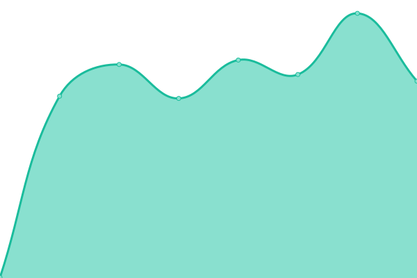 377ms
     
 | 

<a href="https://tradmusica.github.io/history/fw-https-shop-cat-live">100.00%</a>
    

|  [FW HTTPS www +SSL](https://www.folk.world) | 🟩 Up | [fw-https-www-ssl.yml](https://github.com/tradmusica/upptime/commits/HEAD/history/fw-https-www-ssl.yml) | 

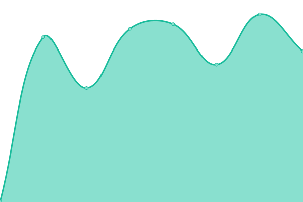 1094ms
     
 | 

<a href="https://tradmusica.github.io/history/fw-https-www-ssl">100.00%</a>
    

|  [FW HTTP www](http://www.folk.world) | 🟩 Up | [fw-http-www.yml](https://github.com/tradmusica/upptime/commits/HEAD/history/fw-http-www.yml) | 

 814ms
     
 | 

<a href="https://tradmusica.github.io/history/fw-http-www">100.00%</a>
    

|  [FW MX](dns-resolve://folk.world) | 🟥 Down | [fw-mx.yml](https://github.com/tradmusica/upptime/commits/HEAD/history/fw-mx.yml) | 

 0ms
     
 | 

<a href="https://tradmusica.github.io/history/fw-mx">0.00%</a>
    

|  [FW PING LIVE](icmp-ping://folk.world) | 🟥 Down | [fw-ping-live.yml](https://github.com/tradmusica/upptime/commits/HEAD/history/fw-ping-live.yml) | 

 0ms
     
 | 

<a href="https://tradmusica.github.io/history/fw-ping-live">0.00%</a>
    

|  [hundetrainerin](https://hundetrainerin.nrw/) | 🟩 Up | [hundetrainerin.yml](https://github.com/tradmusica/upptime/commits/HEAD/history/hundetrainerin.yml) | 

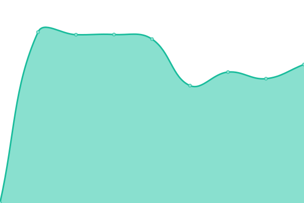 939ms
     
 | 

<a href="https://tradmusica.github.io/history/hundetrainerin">100.00%</a>
    

|  [hundetrainerin](https://www.hundetrainerin.nrw/) | 🟩 Up | [hundetrainerin.yml](https://github.com/tradmusica/upptime/commits/HEAD/history/hundetrainerin.yml) | 

 939ms
     
 | 

<a href="https://tradmusica.github.io/history/hundetrainerin">100.00%</a>
    

|  [hundetrainerin non-SSL](http://www.hundetrainerin.nrw/) | 🟩 Up | [hundetrainerin-non-ssl.yml](https://github.com/tradmusica/upptime/commits/HEAD/history/hundetrainerin-non-ssl.yml) | 

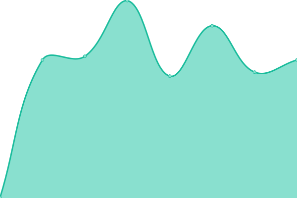 571ms
     
 | 

<a href="https://tradmusica.github.io/history/hundetrainerin-non-ssl">100.00%</a>
    

|  [hundetrainerin non-WWW](https://hundetrainerin.nrw/) | 🟩 Up | [hundetrainerin-non-www.yml](https://github.com/tradmusica/upptime/commits/HEAD/history/hundetrainerin-non-www.yml) | 

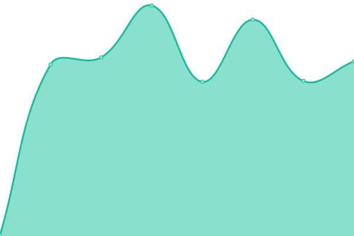 255ms
     
 | 

<a href="https://tradmusica.github.io/history/hundetrainerin-non-www">100.00%</a>
    

|  [hundetrainerin non-WWW non-SSL](http://hundetrainerin.nrw/) | 🟩 Up | [hundetrainerin-non-www-non-ssl.yml](https://github.com/tradmusica/upptime/commits/HEAD/history/hundetrainerin-non-www-non-ssl.yml) | 

 577ms
     
 | 

<a href="https://tradmusica.github.io/history/hundetrainerin-non-www-non-ssl">100.00%</a>
    

|  [nyckelharpa-spielen](https://nyckelharpa-spielen.de/) | 🟩 Up | [nyckelharpa-spielen.yml](https://github.com/tradmusica/upptime/commits/HEAD/history/nyckelharpa-spielen.yml) | 

 1581ms
     
 | 

<a href="https://tradmusica.github.io/history/nyckelharpa-spielen">100.00%</a>
    

|  [spielleute.com MX](dns-resolve://spielleute.com) | 🟥 Down | [spielleute-com-mx.yml](https://github.com/tradmusica/upptime/commits/HEAD/history/spielleute-com-mx.yml) | 

 0ms
     
 | 

<a href="https://tradmusica.github.io/history/spielleute-com-mx">0.00%</a>
    

|  [VS MX](dns-resolve://spielleute.de) | 🟥 Down | [vs-mx.yml](https://github.com/tradmusica/upptime/commits/HEAD/history/vs-mx.yml) | 

 0ms
     
 | 

<a href="https://tradmusica.github.io/history/vs-mx">0.00%</a>
    

|  [verlag-der-spielleute.de MX](dns-resolve://verlag-der-spielleute.de) | 🟥 Down | [verlag-der-spielleute-de-mx.yml](https://github.com/tradmusica/upptime/commits/HEAD/history/verlag-der-spielleute-de-mx.yml) | 

 0ms
     
 | 

<a href="https://tradmusica.github.io/history/verlag-der-spielleute-de-mx">0.00%</a>
    

|  [VS HTTP non-www](http://spielleute.de) | 🟩 Up | [vs-http-non-www.yml](https://github.com/tradmusica/upptime/commits/HEAD/history/vs-http-non-www.yml) | 

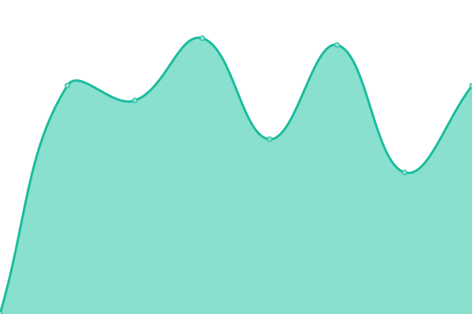 853ms
     
 | 

<a href="https://tradmusica.github.io/history/vs-http-non-www">100.00%</a>
    

|  [VS HTTPS non-www +SSL](https://spielleute.de) | 🟩 Up | [vs-https-non-www-ssl.yml](https://github.com/tradmusica/upptime/commits/HEAD/history/vs-https-non-www-ssl.yml) | 

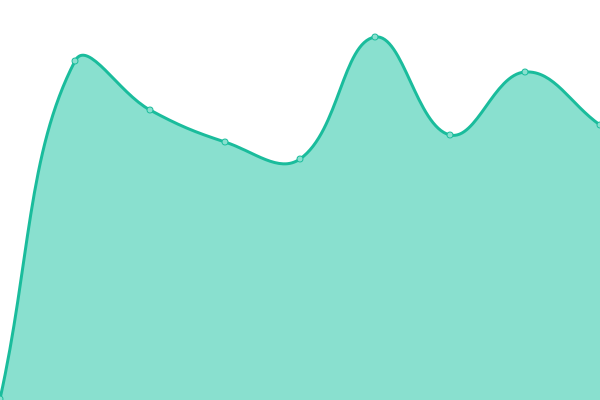 301ms
     
 | 

<a href="https://tradmusica.github.io/history/vs-https-non-www-ssl">100.00%</a>
    

|  [VS HTTPS www +SSL](https://www.spielleute.de) | 🟩 Up | [vs-https-www-ssl.yml](https://github.com/tradmusica/upptime/commits/HEAD/history/vs-https-www-ssl.yml) | 

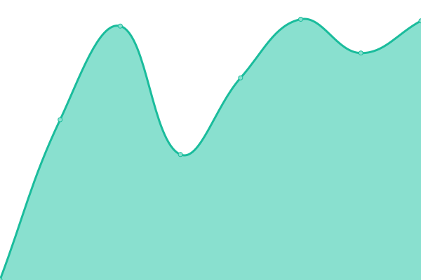 1209ms
     
 | 

<a href="https://tradmusica.github.io/history/vs-https-www-ssl">100.00%</a>
    

|  [VS HTTP www](http://www.spielleute.de) | 🟩 Up | [vs-http-www.yml](https://github.com/tradmusica/upptime/commits/HEAD/history/vs-http-www.yml) | 

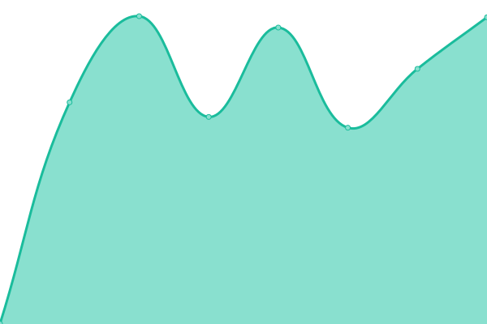 977ms
     
 | 

<a href="https://tradmusica.github.io/history/vs-http-www">100.00%</a>
    

|  [VS PBF HTTP](http://spielleute.de/palmbayfrost) | 🟩 Up | [vs-pbf-http.yml](https://github.com/tradmusica/upptime/commits/HEAD/history/vs-pbf-http.yml) | 

 880ms
     
 | 

<a href="https://tradmusica.github.io/history/vs-pbf-http">100.00%</a>
    

|  [VS PBF HTTPS](https://spielleute.de/palmbayfrost) | 🟩 Up | [vs-pbf-https.yml](https://github.com/tradmusica/upptime/commits/HEAD/history/vs-pbf-https.yml) | 

 442ms
     
 | 

<a href="https://tradmusica.github.io/history/vs-pbf-https">100.00%</a>
    

|  [VS PBF HTTPS www](https://www.spielleute.de/palmbayfrost) | 🟩 Up | [vs-pbf-https-www.yml](https://github.com/tradmusica/upptime/commits/HEAD/history/vs-pbf-https-www.yml) | 

 614ms
     
 | 

<a href="https://tradmusica.github.io/history/vs-pbf-https-www">100.00%</a>
    

|  [VS PBF HTTP www](http://www.spielleute.de/palmbayfrost) | 🟩 Up | [vs-pbf-http-www.yml](https://github.com/tradmusica/upptime/commits/HEAD/history/vs-pbf-http-www.yml) | 

 778ms
     
 | 

<a href="https://tradmusica.github.io/history/vs-pbf-http-www">100.00%</a>
    

<!--end: status pages-->

[**Visit our status website →**](https://tradmusica.github.io)

## 📄 License

- Powered by: [Upptime](https://github.com/upptime/upptime)
- Code: [MIT](./LICENSE) © [Anand Chowdhary](https://anandchowdhary.com), supported by [Pabio](https://pabio.com)
- Data in the `./history` directory: [Open Database License](https://opendatacommons.org/licenses/odbl/1-0/)
