# [📈 Live Status](https://tradmusica.github.io/upptime/): <!--live status--> **🟧 Partial outage**

This repository contains the open-source uptime monitor and status page for [tradmusica](https://tradmusica.github.io/upptime/), powered by [Upptime](https://github.com/upptime/upptime).

With [Upptime](https://upptime.js.org), you can get your own unlimited and free uptime monitor and status page, powered entirely by a GitHub repository. We use [Issues](https://github.com/tradmusica/upptime/issues) as incident reports, [Actions](https://github.com/tradmusica/upptime/actions) as uptime monitors, and [Pages](https://tradmusica.github.io/upptime/) for the status page.

<!--start: status pages-->
<!-- This summary is generated by Upptime (https://github.com/upptime/upptime) -->
<!-- Do not edit this manually, your changes will be overwritten -->
<!-- prettier-ignore -->
| URL | Status | History | Response Time | Uptime |
| --- | ------ | ------- | ------------- | ------ |
|  [bagpipe Category](https://bagpipe.de/onlinekurse-dudelsack/) | 🟩 Up | [bagpipe-category.yml](https://github.com/tradmusica/upptime/commits/HEAD/history/bagpipe-category.yml) | 

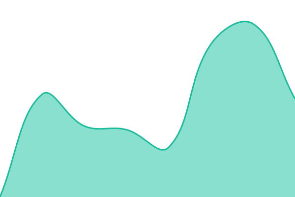 1424ms
     
 | 

<a href="https://tradmusica.github.io/upptime/history/bagpipe-category">100.00%</a>
    

|  [BP Hallo HTTP non-WWW](http://bagpipe.de/hallo-dudelsack) | 🟩 Up | [bp-hallo-http-non-www.yml](https://github.com/tradmusica/upptime/commits/HEAD/history/bp-hallo-http-non-www.yml) | 

 2242ms
     
 | 

<a href="https://tradmusica.github.io/upptime/history/bp-hallo-http-non-www">100.00%</a>
    

|  [BP Hallo HTTPS non-WWW](https://bagpipe.de/hallo-dudelsack) | 🟩 Up | [bp-hallo-https-non-www.yml](https://github.com/tradmusica/upptime/commits/HEAD/history/bp-hallo-https-non-www.yml) | 

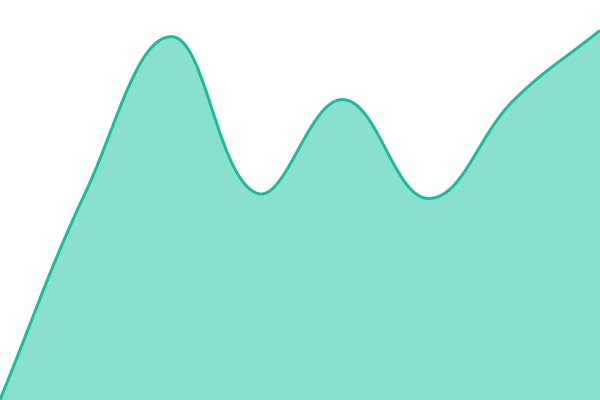 1274ms
     
 | 

<a href="https://tradmusica.github.io/upptime/history/bp-hallo-https-non-www">100.00%</a>
    

|  [BP Hallo HTTPS WWW](https://www.bagpipe.de/hallo-dudelsack) | 🟩 Up | [bp-hallo-https-www.yml](https://github.com/tradmusica/upptime/commits/HEAD/history/bp-hallo-https-www.yml) | 

 2019ms
     
 | 

<a href="https://tradmusica.github.io/upptime/history/bp-hallo-https-www">100.00%</a>
    

|  [BP Hallo HTTP WWW](http://www.bagpipe.de/hallo-dudelsack) | 🟩 Up | [bp-hallo-http-www.yml](https://github.com/tradmusica/upptime/commits/HEAD/history/bp-hallo-http-www.yml) | 

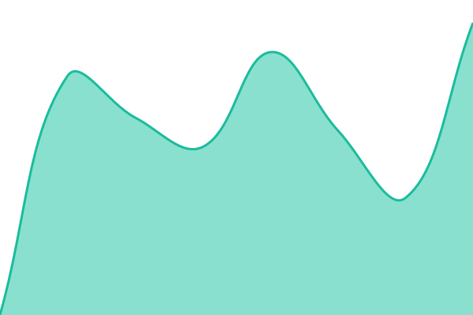 1571ms
     
 | 

<a href="https://tradmusica.github.io/upptime/history/bp-hallo-http-www">100.00%</a>
    

|  [BP HTTP non-www](http://bagpipe.de) | 🟩 Up | [bp-http-non-www.yml](https://github.com/tradmusica/upptime/commits/HEAD/history/bp-http-non-www.yml) | 

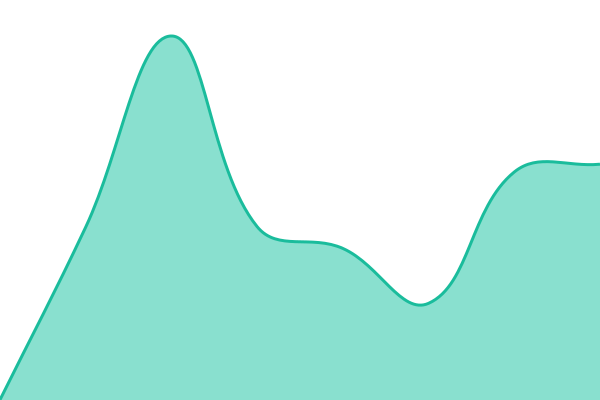 846ms
     
 | 

<a href="https://tradmusica.github.io/upptime/history/bp-http-non-www">100.00%</a>
    

|  [BP HTTPS non-www COMP](https://bagpipe.de/das-multi-einsteiger-set-fuer-den-schottischen-dudelsack/) | 🟩 Up | [bp-https-non-www-comp.yml](https://github.com/tradmusica/upptime/commits/HEAD/history/bp-https-non-www-comp.yml) | 

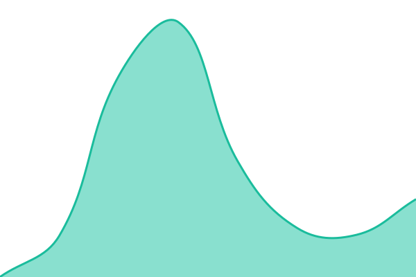 1071ms
     
 | 

<a href="https://tradmusica.github.io/upptime/history/bp-https-non-www-comp">100.00%</a>
    

|  [BP HTTPS non-www SHOP](https://bagpipe.de/shop/) | 🟩 Up | [bp-https-non-www-shop.yml](https://github.com/tradmusica/upptime/commits/HEAD/history/bp-https-non-www-shop.yml) | 

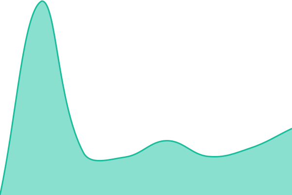 776ms
     
 | 

<a href="https://tradmusica.github.io/upptime/history/bp-https-non-www-shop">100.00%</a>
    

|  [BP HTTPS non-www +SSL](https://bagpipe.de) | 🟩 Up | [bp-https-non-www-ssl.yml](https://github.com/tradmusica/upptime/commits/HEAD/history/bp-https-non-www-ssl.yml) | 

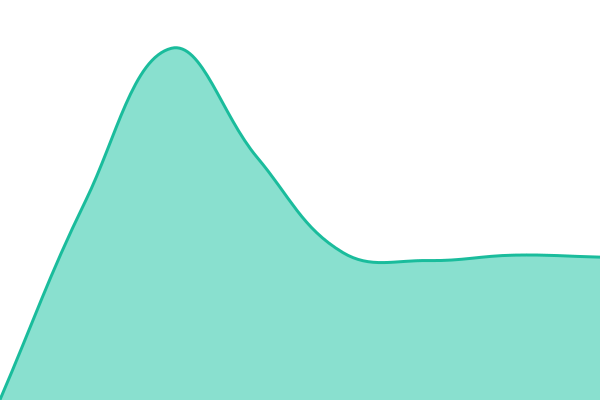 574ms
     
 | 

<a href="https://tradmusica.github.io/upptime/history/bp-https-non-www-ssl">100.00%</a>
    

|  [BP HTTPS www +SSL](https://www.bagpipe.de) | 🟩 Up | [bp-https-www-ssl.yml](https://github.com/tradmusica/upptime/commits/HEAD/history/bp-https-www-ssl.yml) | 

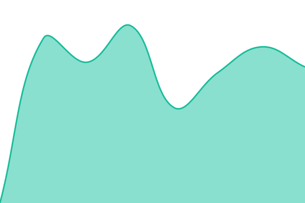 1155ms
     
 | 

<a href="https://tradmusica.github.io/upptime/history/bp-https-www-ssl">100.00%</a>
    

|  [carovana HTTP](http://carovana.ch) | 🟩 Up | [carovana-http.yml](https://github.com/tradmusica/upptime/commits/HEAD/history/carovana-http.yml) | 

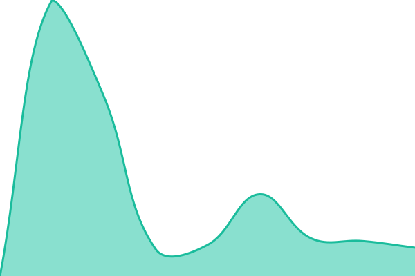 1296ms
     
 | 

<a href="https://tradmusica.github.io/upptime/history/carovana-http">100.00%</a>
    

|  [carovana HTTPS](https://carovana.ch) | 🟩 Up | [carovana-https.yml](https://github.com/tradmusica/upptime/commits/HEAD/history/carovana-https.yml) | 

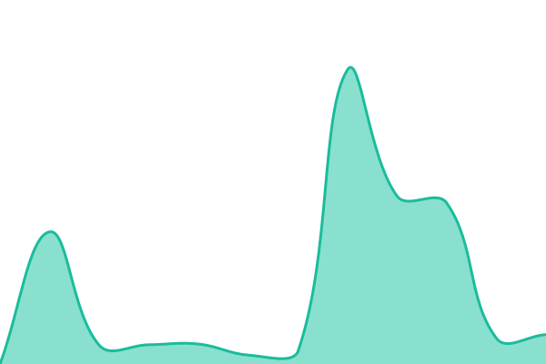 1944ms
     
 | 

<a href="https://tradmusica.github.io/upptime/history/carovana-https">100.00%</a>
    

|  [carovana HTTPS WWW](https://www.carovana.ch) | 🟩 Up | [carovana-https-www.yml](https://github.com/tradmusica/upptime/commits/HEAD/history/carovana-https-www.yml) | 

 3705ms
     
 | 

<a href="https://tradmusica.github.io/upptime/history/carovana-https-www">98.71%</a>
    

|  [carovana HTTP WWW](http://www.carovana.ch) | 🟩 Up | [carovana-http-www.yml](https://github.com/tradmusica/upptime/commits/HEAD/history/carovana-http-www.yml) | 

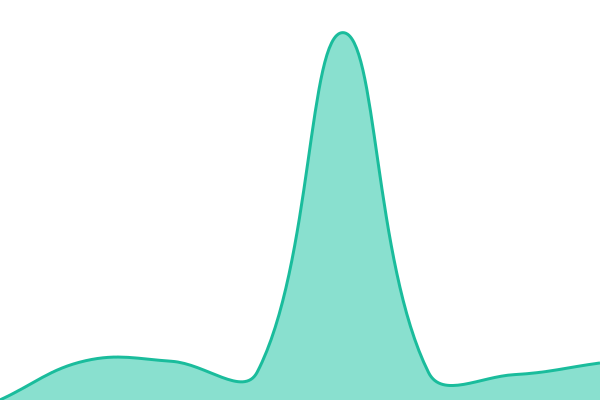 1605ms
     
 | 

<a href="https://tradmusica.github.io/upptime/history/carovana-http-www">100.00%</a>
    

|  [BP HTTP www](http://www.bagpipe.de) | 🟩 Up | [bp-http-www.yml](https://github.com/tradmusica/upptime/commits/HEAD/history/bp-http-www.yml) | 

 1602ms
     
 | 

<a href="https://tradmusica.github.io/upptime/history/bp-http-www">100.00%</a>
    

|  [BP MX](dns-resolve://bagpipe.de) | 🟥 Down | [bp-mx.yml](https://github.com/tradmusica/upptime/commits/HEAD/history/bp-mx.yml) | 

 0ms
     
 | 

<a href="https://tradmusica.github.io/upptime/history/bp-mx">0.00%</a>
    

|  [FW HTTP non-www](http://folk.world) | 🟩 Up | [fw-http-non-www.yml](https://github.com/tradmusica/upptime/commits/HEAD/history/fw-http-non-www.yml) | 

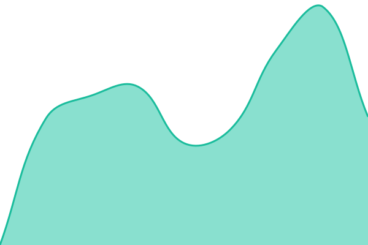 1981ms
     
 | 

<a href="https://tradmusica.github.io/upptime/history/fw-http-non-www">100.00%</a>
    

|  [FW HTTPS DE BlogPost LIVE](https://folk.world/de/undaunted-von-stout-will-irischen-folk-neu-interpretieren/) | 🟩 Up | [fw-https-de-blog-post-live.yml](https://github.com/tradmusica/upptime/commits/HEAD/history/fw-https-de-blog-post-live.yml) | 

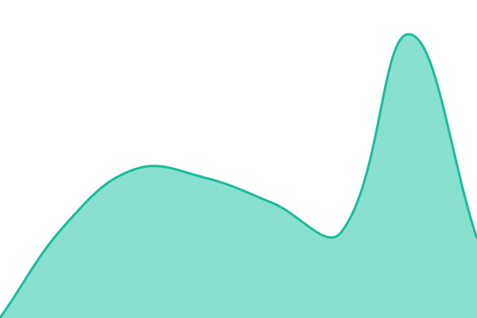 1312ms
     
 | 

<a href="https://tradmusica.github.io/upptime/history/fw-https-de-blog-post-live">100.00%</a>
    

|  [FW HTTPS DE BlogTag LIVE](https://folk.world/de/tag/dudelsack/) | 🟩 Up | [fw-https-de-blog-tag-live.yml](https://github.com/tradmusica/upptime/commits/HEAD/history/fw-https-de-blog-tag-live.yml) | 

 1094ms
     
 | 

<a href="https://tradmusica.github.io/upptime/history/fw-https-de-blog-tag-live">100.00%</a>
    

|  [FW HTTPS DE Cart LIVE](https://folk.world/de/warenkorb/) | 🟩 Up | [fw-https-de-cart-live.yml](https://github.com/tradmusica/upptime/commits/HEAD/history/fw-https-de-cart-live.yml) | 

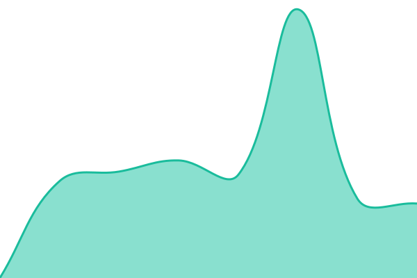 591ms
     
 | 

<a href="https://tradmusica.github.io/upptime/history/fw-https-de-cart-live">100.00%</a>
    

|  [FW HTTPS DE Page LIVE](https://folk.world/de/autor-werden/) | 🟩 Up | [fw-https-de-page-live.yml](https://github.com/tradmusica/upptime/commits/HEAD/history/fw-https-de-page-live.yml) | 

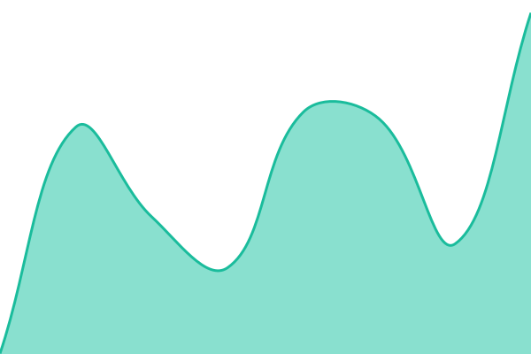 563ms
     
 | 

<a href="https://tradmusica.github.io/upptime/history/fw-https-de-page-live">100.00%</a>
    

|  [FW HTTPS DE ShopHome LIVE](https://folk.world/de/shop/) | 🟩 Up | [fw-https-de-shop-home-live.yml](https://github.com/tradmusica/upptime/commits/HEAD/history/fw-https-de-shop-home-live.yml) | 

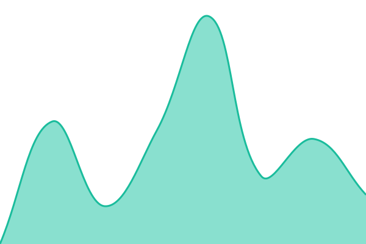 481ms
     
 | 

<a href="https://tradmusica.github.io/upptime/history/fw-https-de-shop-home-live">100.00%</a>
    

|  [FW HTTPS DE ShopProduct LIVE](https://folk.world/de/s/german-smallpipe/) | 🟩 Up | [fw-https-de-shop-product-live.yml](https://github.com/tradmusica/upptime/commits/HEAD/history/fw-https-de-shop-product-live.yml) | 

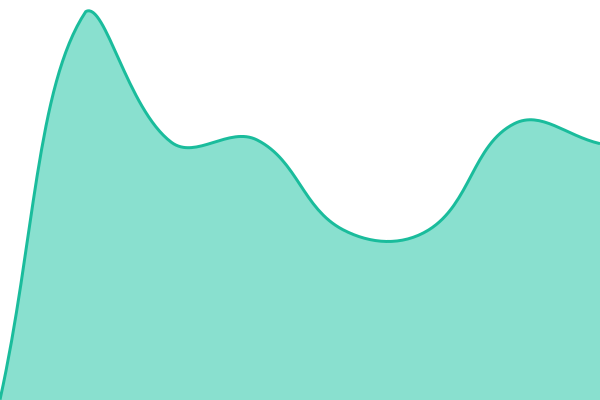 943ms
     
 | 

<a href="https://tradmusica.github.io/upptime/history/fw-https-de-shop-product-live">100.00%</a>
    

|  [FW HTTPS DE ShopTag LIVE](https://folk.world/de/stag/dudelsack/) | 🟩 Up | [fw-https-de-shop-tag-live.yml](https://github.com/tradmusica/upptime/commits/HEAD/history/fw-https-de-shop-tag-live.yml) | 

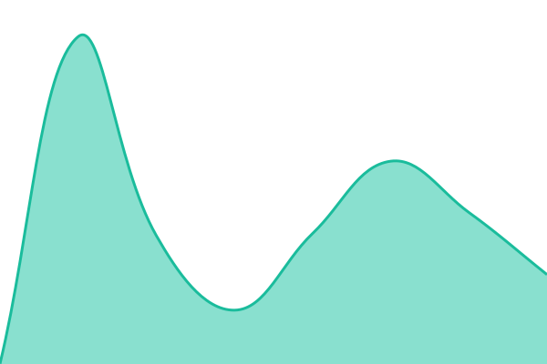 672ms
     
 | 

<a href="https://tradmusica.github.io/upptime/history/fw-https-de-shop-tag-live">100.00%</a>
    

|  [FW HTTPS Feed LIVE](https://folk.world/feed/) | 🟩 Up | [fw-https-feed-live.yml](https://github.com/tradmusica/upptime/commits/HEAD/history/fw-https-feed-live.yml) | 

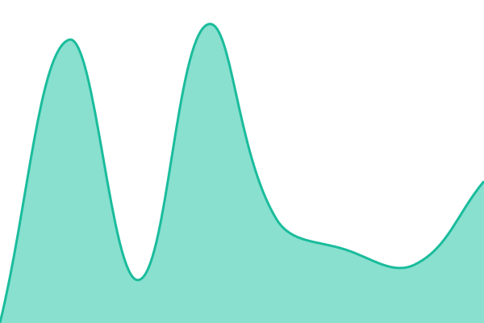 278ms
     
 | 

<a href="https://tradmusica.github.io/upptime/history/fw-https-feed-live">100.00%</a>
    

|  [FW HTTPS folkblog/cat LIVE](https://folk.world/de/folkblog/folk-klange-musikrezensionen/) | 🟩 Up | [fw-https-folkblog-cat-live.yml](https://github.com/tradmusica/upptime/commits/HEAD/history/fw-https-folkblog-cat-live.yml) | 

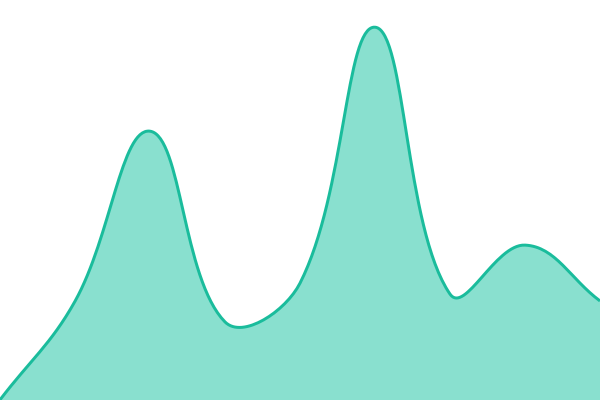 902ms
     
 | 

<a href="https://tradmusica.github.io/upptime/history/fw-https-folkblog-cat-live">100.00%</a>
    

|  [FW HTTPS folkblog LIVE](https://folk.world/folkblog/) | 🟩 Up | [fw-https-folkblog-live.yml](https://github.com/tradmusica/upptime/commits/HEAD/history/fw-https-folkblog-live.yml) | 

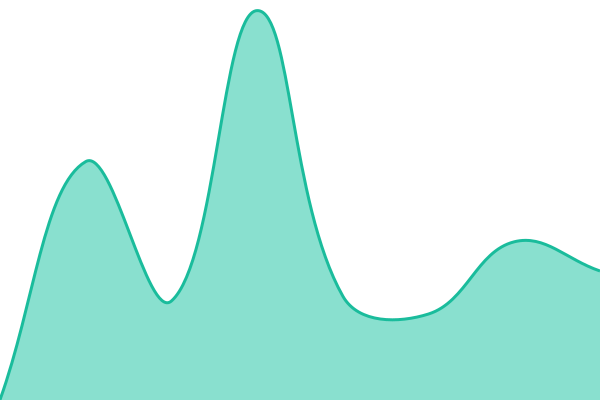 886ms
     
 | 

<a href="https://tradmusica.github.io/upptime/history/fw-https-folkblog-live">100.00%</a>
    

|  [FW HTTPS non-www +SSL](https://folk.world) | 🟩 Up | [fw-https-non-www-ssl.yml](https://github.com/tradmusica/upptime/commits/HEAD/history/fw-https-non-www-ssl.yml) | 

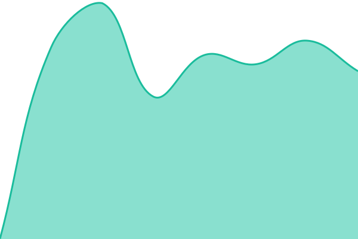 710ms
     
 | 

<a href="https://tradmusica.github.io/upptime/history/fw-https-non-www-ssl">100.00%</a>
    

|  [FW HTTPS ShopCat LIVE](https://folk.world/scat/german-smallpipe/) | 🟩 Up | [fw-https-shop-cat-live.yml](https://github.com/tradmusica/upptime/commits/HEAD/history/fw-https-shop-cat-live.yml) | 

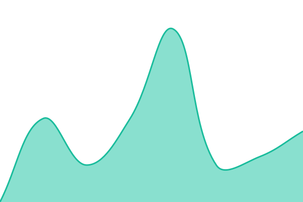 833ms
     
 | 

<a href="https://tradmusica.github.io/upptime/history/fw-https-shop-cat-live">100.00%</a>
    

|  [FW HTTPS www +SSL](https://www.folk.world) | 🟩 Up | [fw-https-www-ssl.yml](https://github.com/tradmusica/upptime/commits/HEAD/history/fw-https-www-ssl.yml) | 

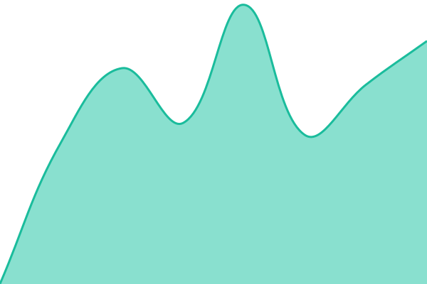 1278ms
     
 | 

<a href="https://tradmusica.github.io/upptime/history/fw-https-www-ssl">100.00%</a>
    

|  [FW HTTP www](http://www.folk.world) | 🟩 Up | [fw-http-www.yml](https://github.com/tradmusica/upptime/commits/HEAD/history/fw-http-www.yml) | 

 1162ms
     
 | 

<a href="https://tradmusica.github.io/upptime/history/fw-http-www">100.00%</a>
    

|  [FW MX](dns-resolve://folk.world) | 🟥 Down | [fw-mx.yml](https://github.com/tradmusica/upptime/commits/HEAD/history/fw-mx.yml) | 

 0ms
     
 | 

<a href="https://tradmusica.github.io/upptime/history/fw-mx">0.00%</a>
    

|  [FW PING LIVE](icmp-ping://folk.world) | 🟥 Down | [fw-ping-live.yml](https://github.com/tradmusica/upptime/commits/HEAD/history/fw-ping-live.yml) | 

 0ms
     
 | 

<a href="https://tradmusica.github.io/upptime/history/fw-ping-live">0.00%</a>
    

|  [hundetrainerin](https://hundetrainerin.nrw/) | 🟩 Up | [hundetrainerin.yml](https://github.com/tradmusica/upptime/commits/HEAD/history/hundetrainerin.yml) | 

 707ms
     
 | 

<a href="https://tradmusica.github.io/upptime/history/hundetrainerin">100.00%</a>
    

|  [hundetrainerin](https://www.hundetrainerin.nrw/) | 🟩 Up | [hundetrainerin.yml](https://github.com/tradmusica/upptime/commits/HEAD/history/hundetrainerin.yml) | 

 707ms
     
 | 

<a href="https://tradmusica.github.io/upptime/history/hundetrainerin">100.00%</a>
    

|  [hundetrainerin non-SSL](http://www.hundetrainerin.nrw/) | 🟩 Up | [hundetrainerin-non-ssl.yml](https://github.com/tradmusica/upptime/commits/HEAD/history/hundetrainerin-non-ssl.yml) | 

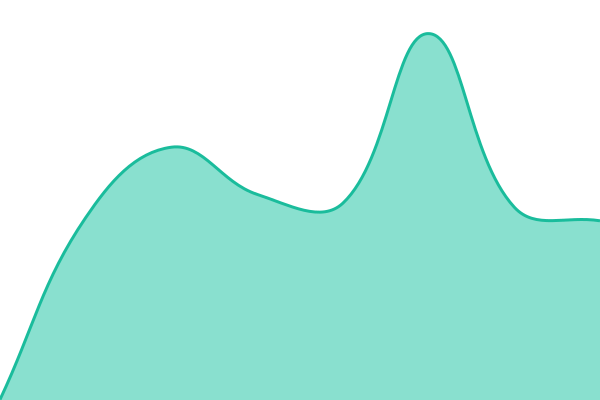 544ms
     
 | 

<a href="https://tradmusica.github.io/upptime/history/hundetrainerin-non-ssl">100.00%</a>
    

|  [hundetrainerin non-WWW](https://hundetrainerin.nrw/) | 🟩 Up | [hundetrainerin-non-www.yml](https://github.com/tradmusica/upptime/commits/HEAD/history/hundetrainerin-non-www.yml) | 

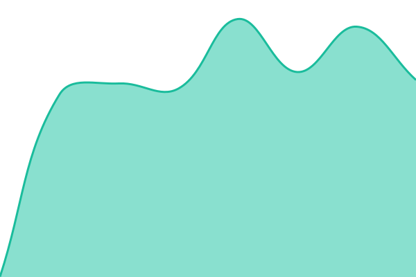 628ms
     
 | 

<a href="https://tradmusica.github.io/upptime/history/hundetrainerin-non-www">100.00%</a>
    

|  [hundetrainerin non-WWW non-SSL](http://hundetrainerin.nrw/) | 🟩 Up | [hundetrainerin-non-www-non-ssl.yml](https://github.com/tradmusica/upptime/commits/HEAD/history/hundetrainerin-non-www-non-ssl.yml) | 

 544ms
     
 | 

<a href="https://tradmusica.github.io/upptime/history/hundetrainerin-non-www-non-ssl">100.00%</a>
    

|  [nyckelharpa-spielen](https://nyckelharpa-spielen.de/) | 🟩 Up | [nyckelharpa-spielen.yml](https://github.com/tradmusica/upptime/commits/HEAD/history/nyckelharpa-spielen.yml) | 

 1578ms
     
 | 

<a href="https://tradmusica.github.io/upptime/history/nyckelharpa-spielen">100.00%</a>
    

|  [Registrar Squarespace tradmusica.us DNS](dns-resolve://tradmusica.us) | 🟥 Down | [registrar-squarespace-tradmusica-us-dns.yml](https://github.com/tradmusica/upptime/commits/HEAD/history/registrar-squarespace-tradmusica-us-dns.yml) | 

 0ms
     
 | 

<a href="https://tradmusica.github.io/upptime/history/registrar-squarespace-tradmusica-us-dns">0.00%</a>
    

|  [Registrar Squarespace tradmusica.ca DNS](dns-resolve://tradmusica.ca) | 🟥 Down | [registrar-squarespace-tradmusica-ca-dns.yml](https://github.com/tradmusica/upptime/commits/HEAD/history/registrar-squarespace-tradmusica-ca-dns.yml) | 

 0ms
     
 | 

<a href="https://tradmusica.github.io/upptime/history/registrar-squarespace-tradmusica-ca-dns">0.00%</a>
    

|  [Registrar Squarespace tradmusica.eu DNS](dns-resolve://tradmusica.eu) | 🟥 Down | [registrar-squarespace-tradmusica-eu-dns.yml](https://github.com/tradmusica/upptime/commits/HEAD/history/registrar-squarespace-tradmusica-eu-dns.yml) | 

 0ms
     
 | 

<a href="https://tradmusica.github.io/upptime/history/registrar-squarespace-tradmusica-eu-dns">0.00%</a>
    

|  [Registrar Squarespace tradmusica.net DNS](dns-resolve://tradmusica.net) | 🟥 Down | [registrar-squarespace-tradmusica-net-dns.yml](https://github.com/tradmusica/upptime/commits/HEAD/history/registrar-squarespace-tradmusica-net-dns.yml) | 

 0ms
     
 | 

<a href="https://tradmusica.github.io/upptime/history/registrar-squarespace-tradmusica-net-dns">0.00%</a>
    

|  [Registrar Squarespace tradmusica.pl DNS](dns-resolve://tradmusica.pl) | 🟥 Down | [registrar-squarespace-tradmusica-pl-dns.yml](https://github.com/tradmusica/upptime/commits/HEAD/history/registrar-squarespace-tradmusica-pl-dns.yml) | 

 0ms
     
 | 

<a href="https://tradmusica.github.io/upptime/history/registrar-squarespace-tradmusica-pl-dns">0.00%</a>
    

|  [Registrar Squarespace tradmusica.nl DNS](dns-resolve://tradmusica.nl) | 🟥 Down | [registrar-squarespace-tradmusica-nl-dns.yml](https://github.com/tradmusica/upptime/commits/HEAD/history/registrar-squarespace-tradmusica-nl-dns.yml) | 

 0ms
     
 | 

<a href="https://tradmusica.github.io/upptime/history/registrar-squarespace-tradmusica-nl-dns">0.00%</a>
    

|  [Registrar Squarespace tradmusica.co.uk DNS](dns-resolve://tradmusica.co.uk) | 🟥 Down | [registrar-squarespace-tradmusica-co-uk-dns.yml](https://github.com/tradmusica/upptime/commits/HEAD/history/registrar-squarespace-tradmusica-co-uk-dns.yml) | 

 0ms
     
 | 

<a href="https://tradmusica.github.io/upptime/history/registrar-squarespace-tradmusica-co-uk-dns">0.00%</a>
    

|  [Registrar Squarespace tradmusica.uk DNS](dns-resolve://tradmusica.uk) | 🟥 Down | [registrar-squarespace-tradmusica-uk-dns.yml](https://github.com/tradmusica/upptime/commits/HEAD/history/registrar-squarespace-tradmusica-uk-dns.yml) | 

 0ms
     
 | 

<a href="https://tradmusica.github.io/upptime/history/registrar-squarespace-tradmusica-uk-dns">0.00%</a>
    

|  [Registrar Squarespace tradmusica.fr DNS](dns-resolve://tradmusica.fr) | 🟥 Down | [registrar-squarespace-tradmusica-fr-dns.yml](https://github.com/tradmusica/upptime/commits/HEAD/history/registrar-squarespace-tradmusica-fr-dns.yml) | 

 0ms
     
 | 

<a href="https://tradmusica.github.io/upptime/history/registrar-squarespace-tradmusica-fr-dns">0.00%</a>
    

|  [Registrar Squarespace tradmusica.de DNS](dns-resolve://tradmusica.de) | 🟥 Down | [registrar-squarespace-tradmusica-de-dns.yml](https://github.com/tradmusica/upptime/commits/HEAD/history/registrar-squarespace-tradmusica-de-dns.yml) | 

 0ms
     
 | 

<a href="https://tradmusica.github.io/upptime/history/registrar-squarespace-tradmusica-de-dns">0.00%</a>
    

|  [Registrar Squarespace tradmusica.com DNS](dns-resolve://tradmusica.com) | 🟥 Down | [registrar-squarespace-tradmusica-com-dns.yml](https://github.com/tradmusica/upptime/commits/HEAD/history/registrar-squarespace-tradmusica-com-dns.yml) | 

 0ms
     
 | 

<a href="https://tradmusica.github.io/upptime/history/registrar-squarespace-tradmusica-com-dns">0.00%</a>
    

|  [Registrar Squarespace folk.events DNS](dns-resolve://folk.events) | 🟥 Down | [registrar-squarespace-folk-events-dns.yml](https://github.com/tradmusica/upptime/commits/HEAD/history/registrar-squarespace-folk-events-dns.yml) | 

 0ms
     
 | 

<a href="https://tradmusica.github.io/upptime/history/registrar-squarespace-folk-events-dns">0.00%</a>
    

|  [Registrar Squarespace boettcher.earth DNS](dns-resolve://boettcher.earth) | 🟥 Down | [registrar-squarespace-boettcher-earth-dns.yml](https://github.com/tradmusica/upptime/commits/HEAD/history/registrar-squarespace-boettcher-earth-dns.yml) | 

 0ms
     
 | 

<a href="https://tradmusica.github.io/upptime/history/registrar-squarespace-boettcher-earth-dns">0.00%</a>
    

|  [Registrar easyname tradmusica.at DNS](dns-resolve://tradmusica.at) | 🟥 Down | [registrar-easyname-tradmusica-at-dns.yml](https://github.com/tradmusica/upptime/commits/HEAD/history/registrar-easyname-tradmusica-at-dns.yml) | 

 0ms
     
 | 

<a href="https://tradmusica.github.io/upptime/history/registrar-easyname-tradmusica-at-dns">0.00%</a>
    

|  [Registrar easyname tradmusica.ch DNS](dns-resolve://tradmusica.ch) | 🟥 Down | [registrar-easyname-tradmusica-ch-dns.yml](https://github.com/tradmusica/upptime/commits/HEAD/history/registrar-easyname-tradmusica-ch-dns.yml) | 

 0ms
     
 | 

<a href="https://tradmusica.github.io/upptime/history/registrar-easyname-tradmusica-ch-dns">0.00%</a>
    

|  [Registrar easyname tradmusica.dk DNS](dns-resolve://tradmusica.dk) | 🟥 Down | [registrar-easyname-tradmusica-dk-dns.yml](https://github.com/tradmusica/upptime/commits/HEAD/history/registrar-easyname-tradmusica-dk-dns.yml) | 

 0ms
     
 | 

<a href="https://tradmusica.github.io/upptime/history/registrar-easyname-tradmusica-dk-dns">0.00%</a>
    

|  [Registrar easyname tradmusica.es DNS](dns-resolve://tradmusica.es) | 🟥 Down | [registrar-easyname-tradmusica-es-dns.yml](https://github.com/tradmusica/upptime/commits/HEAD/history/registrar-easyname-tradmusica-es-dns.yml) | 

 0ms
     
 | 

<a href="https://tradmusica.github.io/upptime/history/registrar-easyname-tradmusica-es-dns">0.00%</a>
    

|  [Registrar easyname tradmusica.it DNS](dns-resolve://tradmusica.it) | 🟥 Down | [registrar-easyname-tradmusica-it-dns.yml](https://github.com/tradmusica/upptime/commits/HEAD/history/registrar-easyname-tradmusica-it-dns.yml) | 

 0ms
     
 | 

<a href="https://tradmusica.github.io/upptime/history/registrar-easyname-tradmusica-it-dns">0.00%</a>
    

|  [Registrar easyname tradmusica.se DNS](dns-resolve://tradmusica.se) | 🟥 Down | [registrar-easyname-tradmusica-se-dns.yml](https://github.com/tradmusica/upptime/commits/HEAD/history/registrar-easyname-tradmusica-se-dns.yml) | 

 0ms
     
 | 

<a href="https://tradmusica.github.io/upptime/history/registrar-easyname-tradmusica-se-dns">0.00%</a>
    

|  [Registrar IONOS tradmusica.org DNS](dns-resolve://tradmusica.org) | 🟥 Down | [registrar-ionos-tradmusica-org-dns.yml](https://github.com/tradmusica/upptime/commits/HEAD/history/registrar-ionos-tradmusica-org-dns.yml) | 

 0ms
     
 | 

<a href="https://tradmusica.github.io/upptime/history/registrar-ionos-tradmusica-org-dns">0.00%</a>
    

|  [Registrar IONOS trike.flights DNS](dns-resolve://trike.flights) | 🟥 Down | [registrar-ionos-trike-flights-dns.yml](https://github.com/tradmusica/upptime/commits/HEAD/history/registrar-ionos-trike-flights-dns.yml) | 

 0ms
     
 | 

<a href="https://tradmusica.github.io/upptime/history/registrar-ionos-trike-flights-dns">0.00%</a>
    

|  [spielleute.com MX](dns-resolve://spielleute.com) | 🟥 Down | [spielleute-com-mx.yml](https://github.com/tradmusica/upptime/commits/HEAD/history/spielleute-com-mx.yml) | 

 0ms
     
 | 

<a href="https://tradmusica.github.io/upptime/history/spielleute-com-mx">0.00%</a>
    

|  [VS MX](dns-resolve://spielleute.de) | 🟥 Down | [vs-mx.yml](https://github.com/tradmusica/upptime/commits/HEAD/history/vs-mx.yml) | 

 0ms
     
 | 

<a href="https://tradmusica.github.io/upptime/history/vs-mx">0.00%</a>
    

|  [verlag-der-spielleute.de MX](dns-resolve://verlag-der-spielleute.de) | 🟥 Down | [verlag-der-spielleute-de-mx.yml](https://github.com/tradmusica/upptime/commits/HEAD/history/verlag-der-spielleute-de-mx.yml) | 

 0ms
     
 | 

<a href="https://tradmusica.github.io/upptime/history/verlag-der-spielleute-de-mx">0.00%</a>
    

|  [VS HTTP non-www](http://spielleute.de) | 🟩 Up | [vs-http-non-www.yml](https://github.com/tradmusica/upptime/commits/HEAD/history/vs-http-non-www.yml) | 

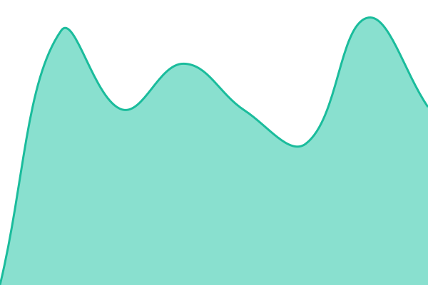 1822ms
     
 | 

<a href="https://tradmusica.github.io/upptime/history/vs-http-non-www">100.00%</a>
    

|  [VS HTTPS non-www +SSL](https://spielleute.de) | 🟩 Up | [vs-https-non-www-ssl.yml](https://github.com/tradmusica/upptime/commits/HEAD/history/vs-https-non-www-ssl.yml) | 

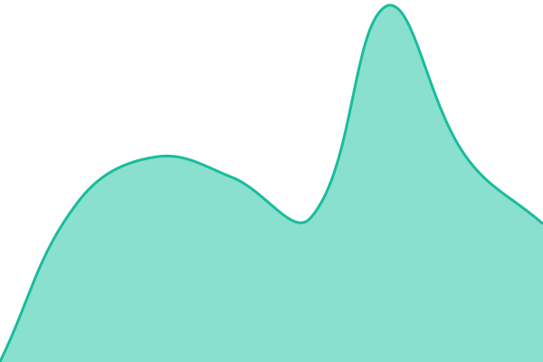 734ms
     
 | 

<a href="https://tradmusica.github.io/upptime/history/vs-https-non-www-ssl">100.00%</a>
    

|  [VS HTTPS www +SSL](https://www.spielleute.de) | 🟩 Up | [vs-https-www-ssl.yml](https://github.com/tradmusica/upptime/commits/HEAD/history/vs-https-www-ssl.yml) | 

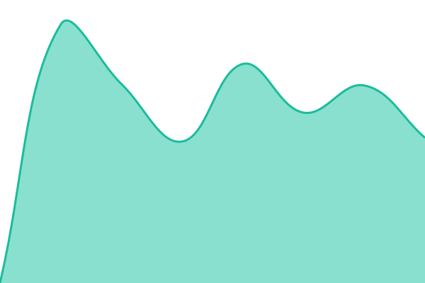 1712ms
     
 | 

<a href="https://tradmusica.github.io/upptime/history/vs-https-www-ssl">100.00%</a>
    

|  [VS HTTP www](http://www.spielleute.de) | 🟩 Up | [vs-http-www.yml](https://github.com/tradmusica/upptime/commits/HEAD/history/vs-http-www.yml) | 

 1750ms
     
 | 

<a href="https://tradmusica.github.io/upptime/history/vs-http-www">100.00%</a>
    

|  [VS PBF HTTP](http://spielleute.de/palmbayfrost) | 🟩 Up | [vs-pbf-http.yml](https://github.com/tradmusica/upptime/commits/HEAD/history/vs-pbf-http.yml) | 

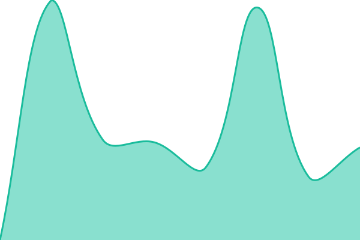 2066ms
     
 | 

<a href="https://tradmusica.github.io/upptime/history/vs-pbf-http">100.00%</a>
    

|  [VS PBF HTTPS](https://spielleute.de/palmbayfrost) | 🟩 Up | [vs-pbf-https.yml](https://github.com/tradmusica/upptime/commits/HEAD/history/vs-pbf-https.yml) | 

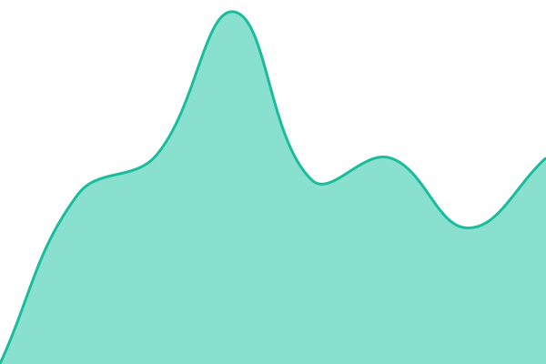 1194ms
     
 | 

<a href="https://tradmusica.github.io/upptime/history/vs-pbf-https">100.00%</a>
    

|  [VS PBF HTTPS www](https://www.spielleute.de/palmbayfrost) | 🟩 Up | [vs-pbf-https-www.yml](https://github.com/tradmusica/upptime/commits/HEAD/history/vs-pbf-https-www.yml) | 

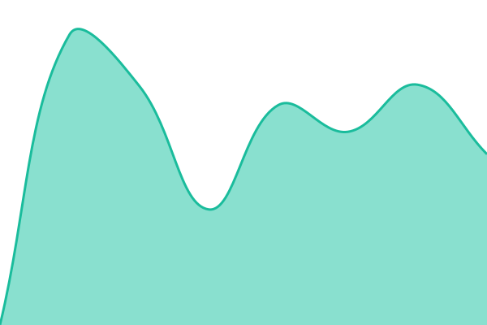 1381ms
     
 | 

<a href="https://tradmusica.github.io/upptime/history/vs-pbf-https-www">100.00%</a>
    

|  [VS PBF HTTP www](http://www.spielleute.de/palmbayfrost) | 🟩 Up | [vs-pbf-http-www.yml](https://github.com/tradmusica/upptime/commits/HEAD/history/vs-pbf-http-www.yml) | 

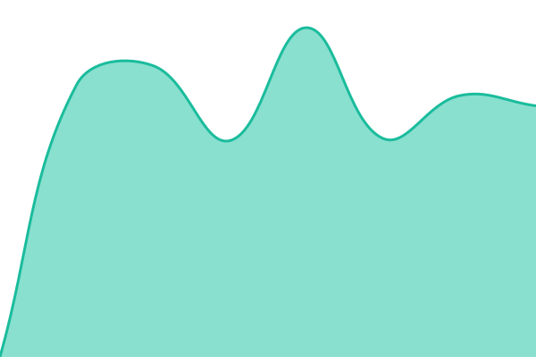 1934ms
     
 | 

<a href="https://tradmusica.github.io/upptime/history/vs-pbf-http-www">100.00%</a>
    

<!--end: status pages-->

[**Visit our status website →**](https://tradmusica.github.io/upptime/)

## 📄 License

- Powered by: [Upptime](https://github.com/upptime/upptime)
- Code: [MIT](./LICENSE) © [Anand Chowdhary](https://anandchowdhary.com), supported by [Pabio](https://pabio.com)
- Data in the `./history` directory: [Open Database License](https://opendatacommons.org/licenses/odbl/1-0/)
